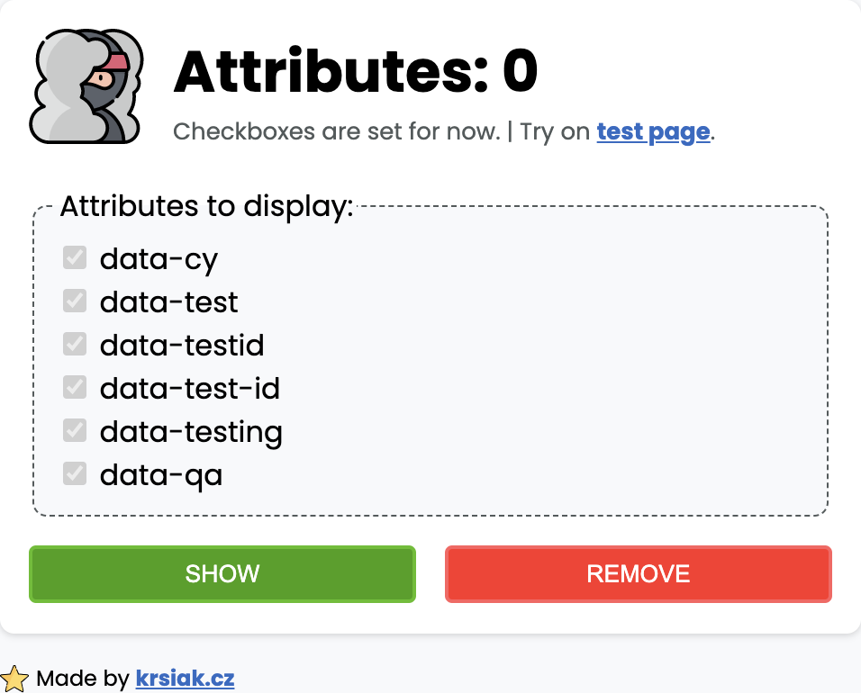

# Chrome extension 'Show data attributes for testing'

Chrome extensions for developers and testers. Show data attributes on your page for easier testing.

## Show data attributes for testing

Extension can show following attributes:

1. `data-cy`
2. `data-test`
3. `data-testid`
4. `data-test-id`
5. `data-testing`
6. `data-qa`

## Testing page on JS Bin

- <https://output.jsbin.com/xutihow>

## Developer

Made by [krsiak.cz](https://krsiak.cz/)

## Attribution

Icons used [Ninja pack](https://www.flaticon.com/packs/ninja-11)

## Package.json

Using **npm package** [chrome-types](https://www.npmjs.com/package/chrome-types) to take advantage of auto-completion for the Chrome API in Manifest version 3.

## `TODO - UI design`

- badge state: <https://developer.chrome.com/docs/extensions/mv3/user_interface/#badge>
- info: <https://developer.chrome.com/docs/extensions/mv3/user_interface/>
- show number of attributes in badge?
- CHROME STORAGE:
  - change badge icon in toolbar based on show / hide
  - keep the state for badge and for header image in storage
  - user clicks show, then clicks outside and closes the popup, kee the state in storage

## `TODO - exercise, create 3 new extensions in new repos`

- <https://developer.chrome.com/docs/extensions/mv3/getstarted/extensions-101/>
- improve content structure
- TypeScript isntall <https://developer.chrome.com/docs/extensions/mv3/getstarted/development-basics/#types>

## `TODO - options page`

- create OPTIONS PAGE: <https://developer.chrome.com/docs/extensions/mv3/options/>

## `TODO - recreate extension in REACT + with TS`

- create separate project to test it first
- <https://blog.logrocket.com/creating-chrome-extension-react-typescript/>
- <https://betterprogramming.pub/creating-chrome-extensions-with-typescript-914873467b65>

## `TODO - test autoupdate URL if works`

- <https://developer.chrome.com/docs/extensions/mv3/linux_hosting/#update_url>
- <https://developer.chrome.com/docs/extensions/mv3/linux_hosting/#testing>

## `TODO - Chrome MANIFEST version update`

- **upgrade MANIFEST to version 3**: <https://developer.chrome.com/docs/extensions/mv3/intro/>
- **MIGRATION**: <https://developer.chrome.com/docs/extensions/mv3/mv3-migration/>
- read: <https://developer.chrome.com/docs/extensions/migrating/to-service-workers/#register-listeners>
- local storage <https://developer.chrome.com/docs/extensions/migrating/to-service-workers/#persist-states>
- setTimeout = to timers Alarm <https://developer.chrome.com/docs/extensions/migrating/to-service-workers/#convert-timers>
- <https://developer.chrome.com/docs/extensions/reference/action/#badge>
- <https://developer.chrome.com/docs/extensions/reference/action/#injecting-a-content-script-on-click>

## `TODO - General stuff`

- update JavaScript with regex
- redesign the look and update CSS
- allow COPY from element on hover
- add box to COPY all attributes + values AND copy only values
- show below attributes with `null` missing the value `""`
- add TEST page
